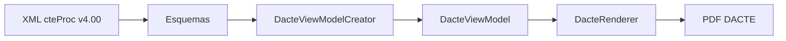

# Arquitetura

O fluxo principal e:

## Camadas

- `Esquemas`: classes de desserializacao do XML do CT-e.
- `Modelo`: ViewModels usados pelo renderer.
- `Render`: desenho final em PDF usando PdfSharpCore.
- `Sample`: console simples para gerar PDFs a partir de uma pasta de XMLs.
